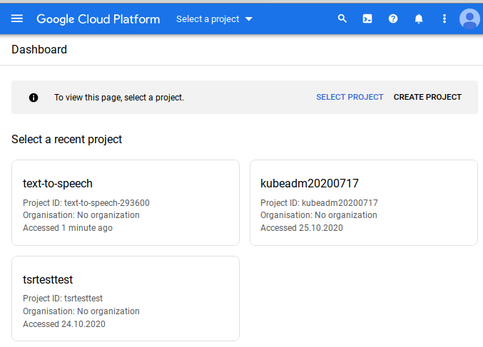
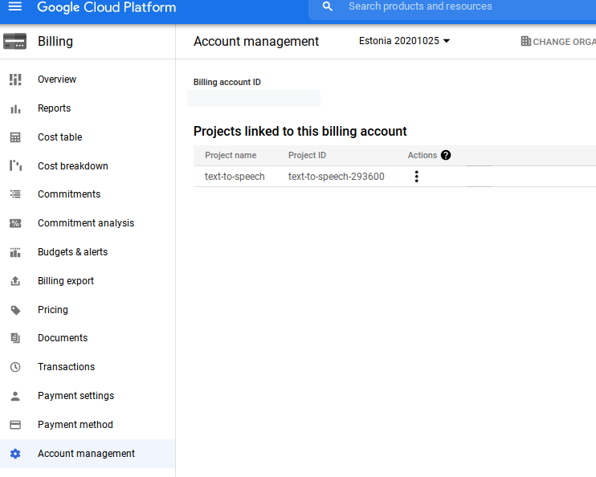

# my-golang-wiki-testtest



```
ryoji@ubuntu:/media/dev/my-golang-testtest$ go mod init github.com/growingspaghetti/my-golang-wiki-testtest
go: creating new go.mod: module github.com/growingspaghetti/my-golang-wiki-testtest
```

```
ryoji@ubuntu:/media/dev/my-golang-testtest$ gcloud init
Welcome! This command will take you through the configuration of gcloud.

Settings from your current configuration [default] are:
core:
  account: r------gmail.com
  disable_usage_reporting: 'True'
  project: text-to-speech-293600

Pick configuration to use:
 [1] Re-initialize this configuration [default] with new settings 
 [2] Create a new configuration
 [3] Switch to and re-initialize existing configuration: [rust-http-rest]
Please enter your numeric choice:  2

Enter configuration name. Names start with a lower case letter and 
contain only lower case letters a-z, digits 0-9, and hyphens '-':  my-golang-wiki-testtest
Your current configuration has been set to: [my-golang-wiki-testtest]

You can skip diagnostics next time by using the following flag:
  gcloud init --skip-diagnostics

Network diagnostic detects and fixes local network connection issues.
Checking network connection...done.                                                                                                                                                
Reachability Check passed.
Network diagnostic passed (1/1 checks passed).

Choose the account you would like to use to perform operations for 
this configuration:
 [4] Log in with a new account
Please enter your numeric choice:  2

You are logged in as: [ryoji@gmail.com].

Pick cloud project to use: 
 [1] kubeadm20200717
 [2] lfnsea
 [3] my-golang-wiki-testtest
 [4] text-to-speech-293600
 [5] tsrtesttest
 [6] Create a new project
Please enter numeric choice or text value (must exactly match list 
item):  3

Your current project has been set to: [my-golang-wiki-testtest].

Not setting default zone/region (this feature makes it easier to use
[gcloud compute] by setting an appropriate default value for the
--zone and --region flag).
See https://cloud.google.com/compute/docs/gcloud-compute section on how to set
default compute region and zone manually. If you would like [gcloud init] to be
able to do this for you the next time you run it, make sure the
Compute Engine API is enabled for your project on the
https://console.developers.google.com/apis page.

Your Google Cloud SDK is configured and ready to use!

* Commands that require authentication will use ryoji@gmail.com by default
* Commands will reference project `my-golang-wiki-testtest` by default
Run `gcloud help config` to learn how to change individual settings

This gcloud configuration is called [my-golang-wiki-testtest]. You can create additional configurations if you work with multiple accounts and/or projects.
Run `gcloud topic configurations` to learn more.

Some things to try next:

* Run `gcloud --help` to see the Cloud Platform services you can interact with. And run `gcloud help COMMAND` to get help on any gcloud command.
* Run `gcloud topic --help` to learn about advanced features of the SDK like arg files and output formatting
```

https://linuxtechlab.com/how-to-install-google-cloud-sdk-in-linux/


```
ryoji@ubuntu:/media/dev/my-golang-testtest$ gcloud app deploy
You are creating an app for project [my-golang-wiki-testtest].
WARNING: Creating an App Engine application for a project is irreversible and the region
cannot be changed. More information about regions is at
<https://cloud.google.com/appengine/docs/locations>.

Please choose the region where you want your App Engine application 
located:

 [1] asia-east2   
 [2] asia-northeast1
 [3] asia-northeast2
 [4] asia-northeast3
 [5] asia-south1  
 [6] asia-southeast2
 [7] australia-southeast1
 [8] europe-west  
 [9] europe-west2 
 [10] europe-west3 
 [11] europe-west6 
 [12] northamerica-northeast1
 [13] southamerica-east1
 [14] us-central   
 [15] us-east1     
 [16] us-east4     
 [17] us-west2     
 [18] us-west3     
 [19] us-west4     
 [20] cancel
Please enter your numeric choice:  10

Creating App Engine application in project [my-golang-wiki-testtest] and region [europe-west3]....done.                                                                            
Services to deploy:

descriptor:      [/media/dev/my-golang-testtest/app.yaml]
source:          [/media/dev/my-golang-testtest]
target project:  [my-golang-wiki-testtest]
target service:  [default]
target version:  [20210218t131639]
target url:      [https://my-golang-wiki-testtest.ey.r.appspot.com]


Do you want to continue (Y/n)?  

Beginning deployment of service [default]...
Created .gcloudignore file. See `gcloud topic gcloudignore` for details.
╔════════════════════════════════════════════════════════════╗
╠═ Uploading 5 files to Google Cloud Storage                ═╣
╚════════════════════════════════════════════════════════════╝
File upload done.
Updating service [default]...⠧       
File upload done.
Updating service [default]...done.                                                                                                                                                 
Setting traffic split for service [default]...done.                                                                                                                                
Deployed service [default] to [https://my-golang-wiki-testtest.ey.r.appspot.com]

You can stream logs from the command line by running:
  $ gcloud app logs tail -s default

To view your application in the web browser run:
  $ gcloud app browse
```

